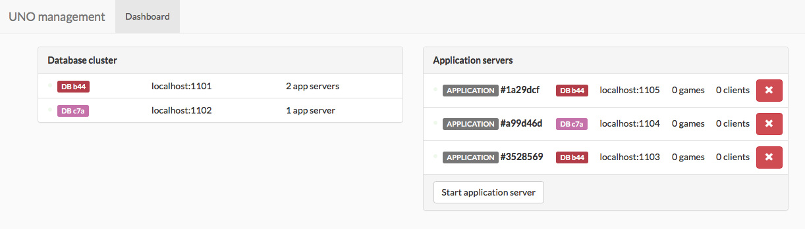

# JLI40D_Uno

This repository contains the code for the assignment for the course distributed systems at the university KU Leuven, campus Ghent.

## The assignment

The assignment was to implemented the game Uno in Java using RMI. Clients can play on several application servers that needed to be synchronized. Currently this project contains the following modules:
- Dispatcher
- Gameclient
- Application server
- Database server

### Dispatcher
The dispatcher module is an rmi server, to which clients can connect and request a server ip/port. Application servers should also connect to this server, so they can be added to the load balancing list.

When starting this server, the number of desired database servers should be provided. The dispatcher will then attempt to start them automatically.

Application servers can be started by the dispatcher as well, controlled by a dashboard. This dashboard—using spring MVC and Thymeleaf—allows the user to start or gracefully shut application servers down, and provides some information about the connections between the application and database server. 

### Application server
The application server hosts games. Clients can connect with one of those servers and join or spectate a hosted game. 

Because games are only hosted on one server at a time, they can reconstruct those games from the database cluster and host them, if requested  to do so by the dispatcher.

### Database server
